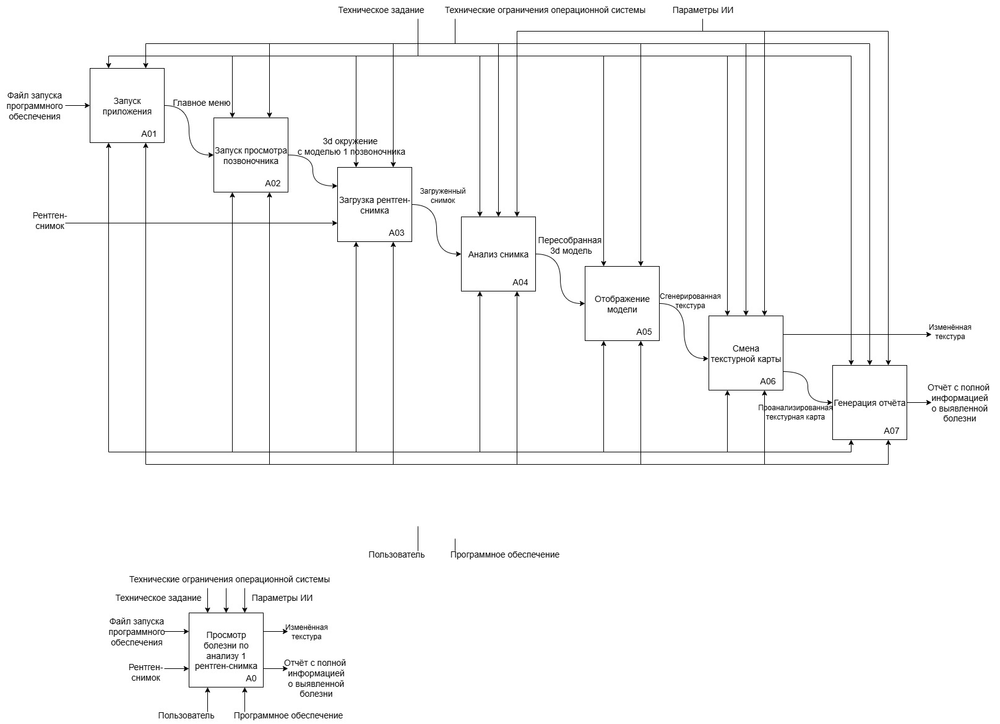
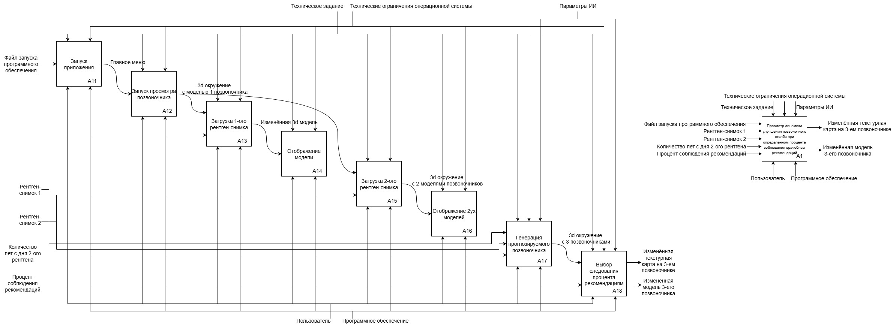
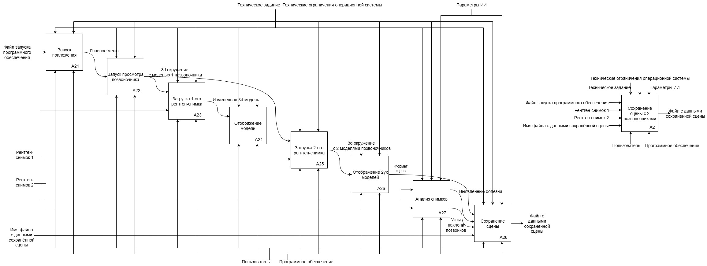

# IDEF 0

**IDEF0 Анализ рентген снимков искусственным интеллектом**

**IDEF0 Просмотр болезни по анализу 1 рентген снимка**

**IDEF0 Просмотр динамики улучшения позвоночного столба при определённом**

**IDEF0 Сохранение сцены с 2 позвоночниками**

