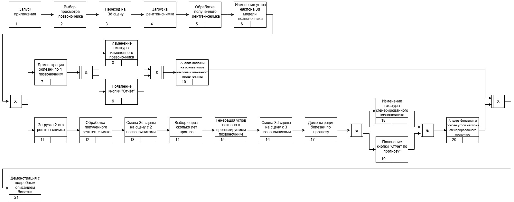
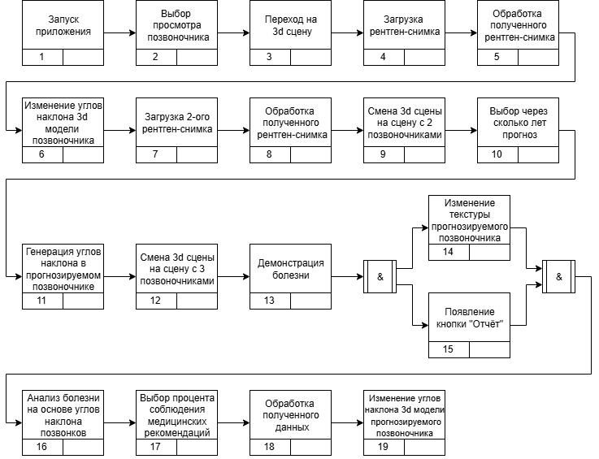
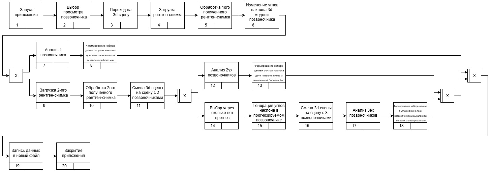

# IDEF 3

**IDEF3 Анализ рентген снимков искусственным интеллектом**

**IDEF3 Просмотр болезни по анализу рентген снимков**

**IDEF3 Просмотр динамики улучшения позвоночного столба при определённом**

**IDEF3 Сохранение сцены с разным числом позвоночников**

